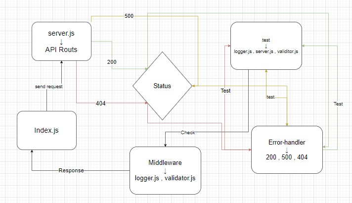

# basic-express-server

# LAB - 02
---
### Deployment Test

###### Author: Ibrahem Alomari

* ##### [Actions](https://github.com/ibrahemomari/basic-express-server/actions)

---
###### Setup


### `.env`
 > PORT: 8000


---

###### Running the app:

* ####  `npm start` , `nodemon`

* #### Endpoint: */status*
    * **Returns Object**

    ```javascript
        {
            "name": "ibrahem"
        }
    ```

---

#### Tests
Unit Tests: `npm run test`
Lint Tests: `npm run lint`

---

#### UML

